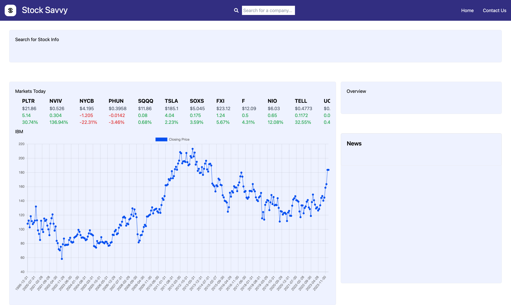
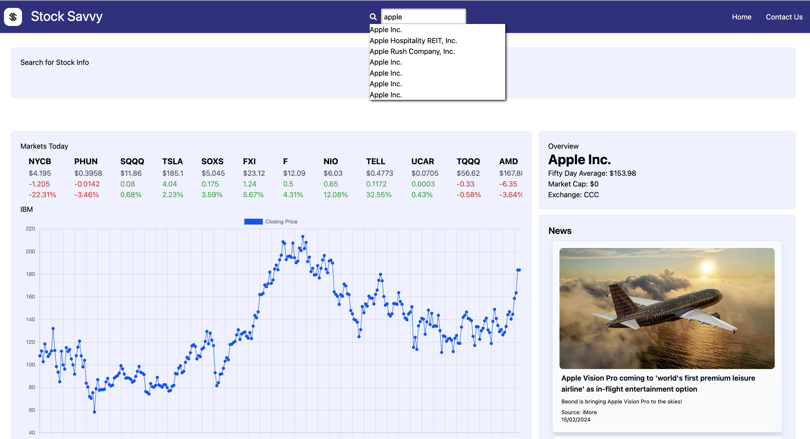

# Stock Savvy

## Description
StockSavvy is a web application designed to assit you with essential data about the stock market. Stock Savvy provides you with the tools to track and analyse key stock information. 
* Monitor metrics such as top gainers and losers during the day, previous 30 day preformance of stocks and other key financial merics.
* Keep up with financial and business news

## Usage
Link to deployed app: https://stock-savvy.netlify.app/
 

 

The StockSavvy dashboard contains:  
 A carousel that displays the biggest gaining and losing stocks during the day. 
 
 
A graph displays the last 30 days performance of the S&P 500
 
 
The search function, allows the user to find stocks using keyuwords, the company name or through a list of suggested company tickers displayed on the drop down. This will display an overview of key financial metrics which allows the user to monitor and track the performance of stocks in real-time. As well as provide you with current related news.  

 

## Credits
### StockSavvy Team
Lavell Francis, Thomas Gledhill, Alex Christakou and Patricia Garcia

EdX Skills Bootcamp

### APIs used:
[Yahoo Finance API ](https://rapidapi.com/manwilbahaa/api/yahoo-finance127/) 
[Alpha Vantge API](https://www.alphavantage.co/) 
[GNews API](https://gnews.io/)

### Libraries used:
[React + Vite](https://vitejs.dev/) 
[Tailwind](https://tailwindcss.com/) 
[Nivo](https://nivo.rocks/) 
[ChartJS](https://www.chartjs.org/) 

## License
This project is released under the MIT licence. Please see license file.

